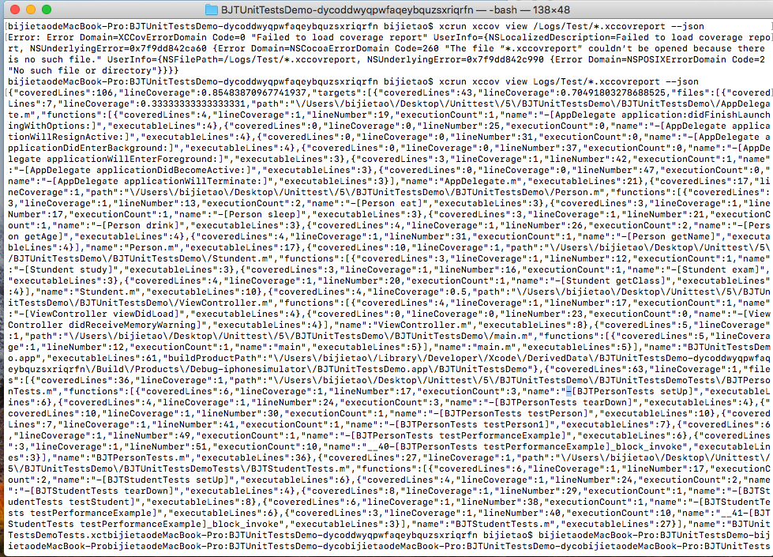

# iOS自动化单元测试之Xcode自带工具xcodebuild与xccov
【博客地址】（https://www.jianshu.com/p/f88d5efbc98f）

为了提高ipa测试包的质量，准备在项目中集成自动化单元测试，关于Xcode的单元测试的自动化，做了一些研究，准备分几篇博客与大家分享一下。

> * iOS自动化单元测试之Xcode自带工具xcodebuild与xccov
> * iOS自动化单元测试之fastlane中xcodebuild与xcov
> * iOS自动化单元测试之生成覆盖率网页与发送钉钉消息
> * iOS自动化单元测试之问题总结

预期达到的效果，可以设定单元测试的覆盖率最低值，终端只输入一条命令，就可以实现自动化单元测试及消息通知
>
1、钉钉消息，如果达到最低覆盖率标准就可收到覆盖率和ipa的地址，达不到只收到覆盖率的通知。
>
 
>
2、网页查看覆盖率
>


## 一、单元测试准备工作
### 1、创建一个含有Unit Tests的项目
> * 前期创建项目时直接添加
> 

>
>
> * 创建项目是未添加，可后期添加。 xcode -> file -> new -> target -> iOS Unit Testing bundle

>
>

### 2、创建XCTestCase的测试文件
> * xcode -> file -> new -> file -> Unit Test case class 


### 3、书写单元测试
```
- (void)testPerson {
    // This is an example of a functional test case.
    // Use XCTAssert and related functions to verify your tests produce the correct results.
    [self.p sleep];
    //    [self.p eat];
    NSString *name  = [self.p getName];
    XCTAssertTrue([name isEqualToString:@"BJT"],@"名字不相等");
}

```

### 4、单元测试target设置
info中添加tests，options中勾选Gather coverage框。xcode9.2和xcode9.3位置不太一样，下面的图片是xcode9.3的配置


**多target的时候注意一下，每一个target都需要勾选Gather coverage框，在info里面添加tests，在manager scheme中勾选shared**


### 5、执行一下common + U可以看到Xcode自带的覆盖率，表示配置完成


## 二、xcodebuild生成.xccovreport
### 1、xcodebuild的终端命令
```
1、指定执行单个文件的用例方法 
bijietaodeMacBook-Pro:BJTUnitTestsDemo bijietao$ xcodebuild test -scheme BJTUnitTestsDemo -target BJTUnitTestsDemo:BJTPersonTests -only-testing:BJTUnitTestsDemoTests/BJTPersonTests -destination 'platform=iOS Simulator,name=iPhone 8 Plus,OS=11.3'

2、指定执行单个文件的一个用例方法 
bijietaodeMacBook-Pro:BJTUnitTestsDemo bijietao$ xcodebuild test -scheme BJTUnitTestsDemo -target BJTUnitTestsDemo:BJTPersonTests -only-testing:BJTUnitTestsDemoTests/BJTPersonTests/testPerson -destination 'platform=iOS Simulator,name=iPhone 8 Plus,OS=11.3'

3、执行全部用例方法 
bijietaodeMacBook-Pro:BJTUnitTestsDemo bijietao$ xcodebuild test -scheme BJTUnitTestsDemo -target BJTUnitTestsDemo -destination 'platform=iOS Simulator,name=iPhone 8 Plus,OS=11.3'
```

具体参数的讲解可以看下面的[官网描述](https://developer.apple.com/library/archive/technotes/tn2339/_index.html#//apple_ref/doc/uid/DTS40014588-CH1-PRODUCT)

```
How do I run unit tests from the command line?

xcodebuild provides several options for running unit tests.
To build and run unit tests from the command line, execute the following command in Terminal:

xcodebuild test [-workspace <your_workspace_name>]
                [-project <your_project_name>]
                -scheme <your_scheme_name>
                -destination <destination-specifier>
                [-only-testing:<test-identifier>]
                [-skip-testing:<test-identifier>]

To build unit tests without running them from the command line, execute the following command in Terminal:

xcodebuild build-for-testing [-workspace <your_workspace_name>]
                             [-project <your_project_name>]
                             -scheme <your_scheme_name>
                             -destination <destination-specifier>

To run unit tests without building them from the command line, execute any of the following command in Terminal:

xcodebuild test-without-building [-workspace <your_workspace_name>]
                                 [-project <your_project_name>]
                                 -scheme <your_scheme_name>
                                 -destination <destination-specifier>
                                 [-only-testing:<test-identifier>]
                                 [-skip-testing:<test-identifier>]


xcodebuild test-without-building -xctestrun <your_xctestrun_name>.xctestrun
                                 -destination <destination-specifier>
                                 [-only-testing:<test-identifier>]
                                 [-skip-testing:<test-identifier>]
```

### 2、查看效果
> * 终端会看到运行效果，及test succeeded的成功提示
> 


> * 可以通过文件路径，查找覆盖率文件
>
在 ~/Library/Developer/Xcode/DerivedData/ 路径下的 Logs/Test中可以查看代码覆盖率文件.xccovreport和.xccovarchive。
>
在Logs/Test目录中，有扩展名为.xccovreport的覆盖率报告文件，和扩展名为.xccovarchive的覆盖率数据归档文件。苹果应用手册中注释说明如下：“覆盖率报告包含有每个target，源文件，以及具有覆盖信息功能/方法的线性覆盖百分比等内容。覆盖率数据归档文件包含有每个文件的原始执行次数“。

## 三、xccov生成覆盖率(支持最低版本Xcode9.3)
因为.xccovreport 与 .xccovarchive，这些文件并不适用于用户查阅，这就是我们需要使用xccov来查看这些文件，并以完美的样式显示报告。
> * 从终端查看代码覆盖率报告；
> * 从代码覆盖率报告中解析出JSON样式数据；
> * 列出已生成代码覆盖率的所有文件；
> * 查看一个特定文件的代码覆盖率报告。
> 

### 1、查看报告 -Default
我们可以以默认格式查看代码覆盖率报告，这种格式并不是很好，但根据Apple的说明，它是用户可读的。在我们的演示项目中，我们可以使用以下命令生成报告：
```
$ xcrun xccov view Logs/Test/*.xccovreport
```
执行上面命令时，需要先前往DerivedData的项目文件夹下，或者写全路径（/Users/bijietao/Library/Developer/Xcode/DerivedData/BJTUnitTestsDemo-dycoddwyqpwfaqeybquzsxriqrfn/Logs/Test/*.xccovreport ）。


效果如下：


### 2、查看报告 - JSON
xccov真正强大的地方，就是能够以JSON格式生成代码覆盖率报告。我们可以使用以下命令来生成JSON格式的报告：
```
$ xcrun xccov view Logs/Test/*.xccovreport --json
```

效果如下：



### 3、列出所有文件
```
$ xcrun xccov view --file-list Logs/Test/*.xccovreport --json
```

### 4、特定文件的代码覆盖率
```
$ xcrun xccov view --file /Users/bijietao/Desktop/Unittest/5/BJTUnitTestsDemo/BJTUnitTestsDemo/AppDelegate.m Logs/Test/*.xccovarchive
```

## 四、总结
#### 1、如果你的项目是多target，配置会有所不同，参考上文。
#### 2、github上的demo [代码传送门](https://github.com/TechAlleyBoy/BJTUnitTestsDemo.git)。
#### 3、准备工作完成，下篇博客准备写**【iOS自动化单元测试之fastlane中xcodebuild与xcov】**，一条命令，执行单元测试，输出测试报告，发送钉钉通知。

